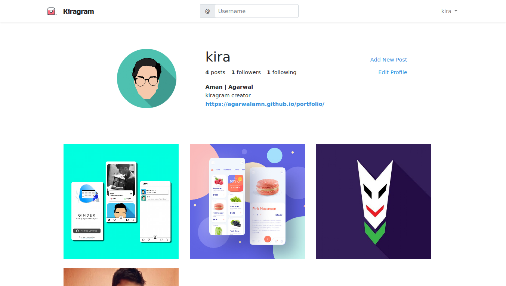

<h3>KIRAGRAM</h3>
  

    <b>Instagram clone made in Laravel</b>
  

   
  
   
   
  
   

### Features ✨

**Made with laravel 🤠** : Implemented all the basic laravel functions like MVC pattern and much more

**Vuejs integration 🤖**: Intergrated Vue for some features like follow button.

**Database relations 🔄** : Table relations like pivot tables and more

**Image handling and storage linking 🛃** : Cropping images and storing it

  <h3>
    Built with ❤️ by
      <a href="https://github.com/agarwalamn">agarwalamn</a>
    
  </h3>

